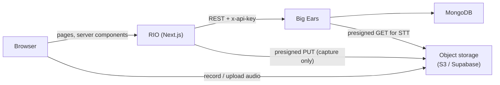

# RIO

**Retail Intelligence OS** — the frontend for the **Retail Intelligence System**.

Dashboards, conversation explorer, capture, and the manager copilot. Talks to [Big Ears](../big-ears) (the backend agentic engine) over HTTP only. No direct database access.

---

## Run it

```bash
npm install
cp .env.example .env.local   # BIG_EARS_API_URL + BIG_EARS_API_KEY (+ storage creds for capture)
npm run dev                  # :3001
```

Big Ears must be running first (`cd ../big-ears && npm run dev` on `:8080`) — RIO has no data of its own.

---

## Architecture

RIO is a **thin product layer**. It renders what Big Ears returns and proxies a few client-facing actions (ingest, copilot, upload) so the API key never reaches the browser.



| Concern | Where it lives |
|---------|----------------|
| Transcripts, visits, scores, agents | Big Ears |
| LLM, STT, scoring, persistence | Big Ears |
| Dashboards, visit detail UI, copilot chat | RIO |
| Recording upload bytes | Browser → storage directly (RIO only signs the URL) |

**The one rule:** if a screen needs data that no endpoint returns, add the endpoint in Big Ears — do not query the database from RIO.

---

## Product surfaces

| Area | Route | What it shows |
|------|-------|----------------|
| **Analyse** | `/dashboard` | Store overview, trends, KPIs |
| | `/sales` | Sales metrics by associate |
| | `/visits` | Conversation feed |
| | `/visits/[id]` | Visit detail — transcript, scores, coaching, evidence |
| | `/customers` | Customer intent, segments, and word frequency |
| | `/demand` | Customer demand signals aggregated across visits |
| **Act** | `/coaching` | Coaching queue from agent output |
| | `/followups` | Follow-up opportunities |
| | `/copilot` | Manager Q&A over store data (proxied to Big Ears) |
| **Capture** | `/ingest` | Record, upload, or paste a transcript |
| **Trust** | `/review` | Visits flagged for human review (low role confidence, etc.) |

Marketing/landing content lives at `/`.

---

## Layout

```
app/
  dashboard/ sales/ visits/ visits/[id]/
  coaching/ demand/ followups/ review/
  copilot/ ingest/
  api/                    thin proxies for client components
    ingest/ jobs/[id]/ copilot/ upload/presign/

lib/
  api.ts                  typed Big Ears client (server-only)
  api-types.ts            generated from OpenAPI — do not edit
  storage.ts              presigned recording uploads
  upload-recording.ts     shared upload helper for capture

components/
  visit-detail-view.tsx   conversation + manager sidebar + evidence
  audio-recorder.tsx      live mic capture on /ingest
  nav.tsx shell.tsx ui.tsx …
```

**Server components** import `lib/api.ts` directly.

**Client components** (`/ingest`, `/copilot`) call `app/api/*`, which attaches `BIG_EARS_API_KEY`. Importing `lib/api.ts` from a client file is a build error by design.

---

## Capture (`/ingest`)

Three ways in — all hand Big Ears a **reference**, not raw pipeline work:

| Mode | Flow |
|------|------|
| **Record live** | Mic → `MediaRecorder` → preview → presigned PUT → `POST /v1/ingest/audio` |
| **Upload file** | File picker → presigned PUT → ingest |
| **Paste transcript** | JSON `DiarizedTranscript` → `POST /v1/ingest/transcript` (skips STT) |

After submit, the page polls `GET /api/jobs/{id}` every 2s for phase, log tail, and visit links when done.

Audio never passes through RIO or Big Ears servers — only storage URIs do. See [Big Ears ingest docs](../big-ears/README.md#ingest) for the backend job phases.

---

## Types

`lib/api-types.ts` is generated from Big Ears' OpenAPI document:

```bash
npm run gen:api   # requires Big Ears running or reachable at BIG_EARS_API_URL
```

Run whenever the backend changes a response shape.

**Do not hand-edit that file.** Fix types in `big-ears/src/domain/api.ts`, then `npm run openapi` in Big Ears and `npm run gen:api` here.

---

## Configuration

| Variable | Purpose |
|----------|---------|
| `BIG_EARS_API_URL` | Big Ears base URL (default `http://localhost:8080`). |
| `BIG_EARS_API_KEY` | Must match `API_KEY` in Big Ears. Never prefix with `NEXT_PUBLIC_`. |
| `RECORDINGS_STORAGE` | `supabase` or `s3` for capture uploads. Auto-detects if unset. |
| `SUPABASE_*` / `AWS_*` | Credentials for presigned recording uploads (see `.env.example`). |

Legacy names `BIGEARS_API_URL` / `BIGEARS_API_KEY` still work as fallbacks.

LLM keys, STT keys, and MongoDB live in Big Ears — not in RIO.

---

## Demo deploy (Vercel + ngrok)

RIO on **Vercel**, Big Ears on your laptop exposed via **ngrok** (keeps GIVA VPN → LiteLLM working).

**Terminal 1 — Big Ears** (VPN on for `litellm.internal.givadiva.co`):

```bash
cd big-ears && npm run dev
```

**Terminal 2 — ngrok**:

```bash
cd big-ears && bash scripts/ngrok-tunnel.sh
# copy the https://….ngrok-free.app URL
```

**Terminal 3 — Vercel**:

```bash
cd rio
export BIG_EARS_NGROK_URL=https://YOUR-ID.ngrok-free.app
export BIG_EARS_API_KEY=dev-local-key          # same as big-ears API_KEY
# optional — for /ingest uploads:
export SUPABASE_URL=… SUPABASE_SERVICE_ROLE_KEY=… SUPABASE_STORAGE_BUCKET=bigears-recordings
export RECORDINGS_STORAGE=supabase
npx vercel login    # once
bash scripts/deploy-vercel.sh
```

RIO server calls Big Ears through ngrok; the `ngrok-skip-browser-warning` header is added automatically in `lib/api.ts`.

**While demoing:** keep Big Ears and ngrok running. Free ngrok URLs change on restart — re-run `deploy-vercel.sh` with the new URL.

---

## Scripts

| Command | Purpose |
|---------|---------|
| `npm run dev` | Dev server on port **3001** |
| `npm run build` | Production build |
| `npm run typecheck` | TypeScript check |
| `npm run gen:api` | Regenerate `lib/api-types.ts` from Big Ears OpenAPI |
